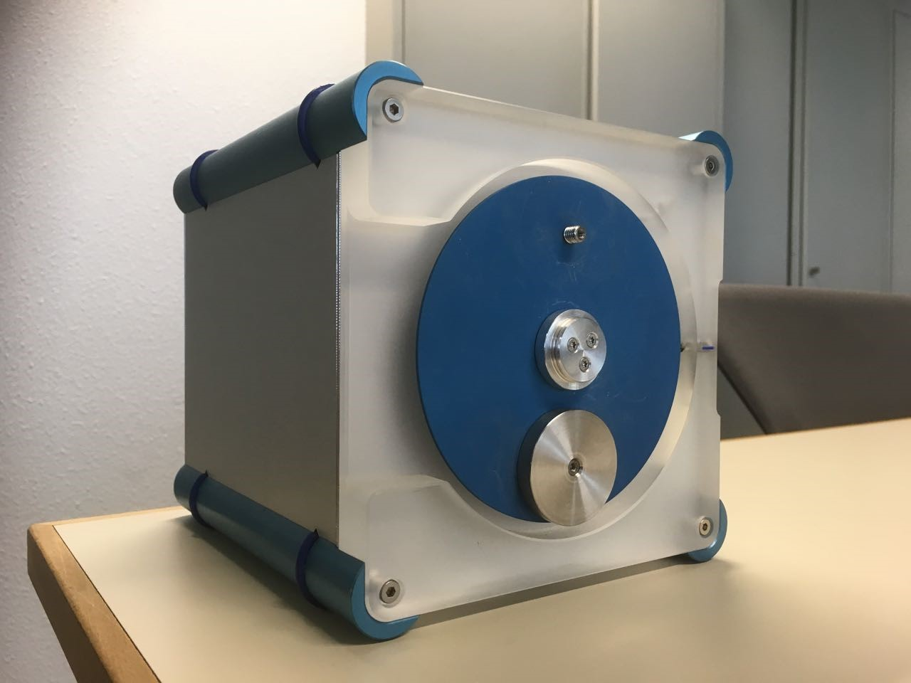

# gym-unbalanced-disk

This is the gym python environment for the unbalanced disk as seen below



This includes both a simulated and an experimental setup. 

# Simulator

## Installation python Simulator

Use command prompt or equivalent and enter

```
python -m pip install git+https://github.com/GerbenBeintema/gym-unbalanced-disk@master
```

or download the repository and install using

```
git clone https://github.com/GerbenBeintema/gym-unbalanced-disk.git #(or use manual download on the github page)
cd gym-unbalanced-disk
pip install -e .
```

## Installation MATLAB Simulator

Download the `matlab-simulator` files and either use the function or the Simulink files. 

# Connecting to the experimental setup

1. Install the usb drivers using the instructions in `WindowsDcscUSB/`. 


## Additional Experimental setup install

To use the experimental setup you will need to do the following things.

1. Install the usb drivers using the instructions in `WindowsDcscUSB/`. 
2. Install MATLAB python engine. [See matlabworks](https://nl.mathworks.com/help/matlab/matlab_external/install-the-matlab-engine-for-python.html)

If you installed python through anaconda, look for anaconda prompt in the start menu and run it in administrator mode to install the Matlab python engine.

## Basic use of simulation

```
import gym, gym_unbalanced_disk, time

env = gym.make('unbalanced-disk-v0', dt=0.025, umax=4.) 
#or use gym_unbalanced_disk.UnbalancedDisk(dt=0.025, umax=4.)

obs = env.reset()
try:
    for i in range(200):
        obs, reward, done, info = env.step(env.action_space.sample()) #random action
        print(obs,reward)
        env.render()
        time.sleep(1/24)
        if done:
            obs = env.reset()
finally: #this will always run
    env.close()
```

## Environments

### Simulations

'unbalanced-disk-v0' or `gym_unbalanced_disk.UnbalancedDisk` which is the simulation

'unbalanced-disk-sincos-v0' or `gym_unbalanced_disk.UnbalancedDisk_sincos` same as above where the angle is now expressed in sine and cos components. (useful for RL)

### Experimental setups.

'unbalanced-disk-exp-v0' or `gym_unbalanced_disk.UnbalancedDisk_exp` which is the experiment

'unbalanced-disk-exp-sincos-v0' or `gym_unbalanced_disk.UnbalancedDisk_exp_sincos` same as above where the angle is now expressed in sine and cos components. (useful for RL)
